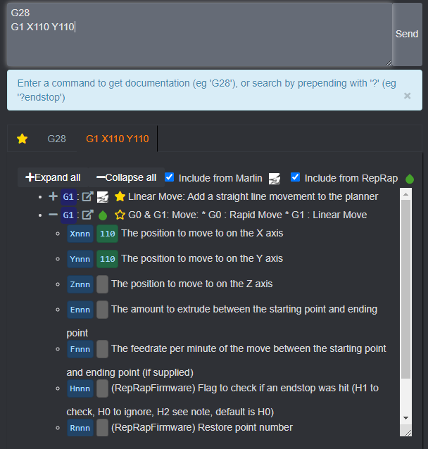

gcode-documentation
==

A module that parses user GCode, and annotates it with documentation.

This was originally created in [Octoprint] plugin [MarlinGcodeDocumentation],
and needs the parsed documentation data to function.

[Octoprint]:https://octoprint.org/
[MarlinGcodeDocumentation]:https://plugins.octoprint.org/plugins/marlingcodedocumentation/

